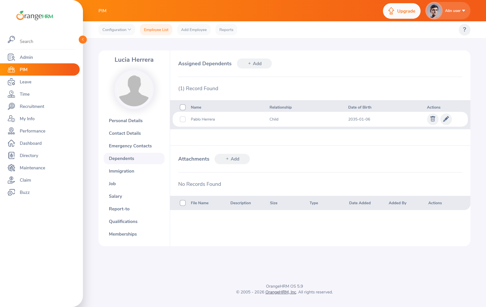

# BUG-008 — «Dependents» acepta fecha de nacimiento futura en una persona a cargo

| | |
| --- | --- |
| **Severidad** | Media |
| **Prioridad** | Baja |
| **Estado** | Abierto — *requiere confirmación de negocio* |
| **Módulo** | PIM > Dependents |
| **Requisito relacionado** | [RF-26, RN-01](../00-requisitos.md#4-ficha-del-empleado--resto-de-secciones) |
| **Caso de prueba** | [CP-032](../02-casos-de-prueba.md#cp-032) |
| **Entorno** | Chrome (estable) · Windows 11 Pro 24H2 · `opensource-demo.orangehrmlive.com` (OrangeHRM OS 5.9) |
| **Reportado por** | David Coya Moreno |

## Precondiciones

Sesión iniciada con el usuario `Admin`. Ficha de un empleado de prueba abierta.

## Pasos para reproducir

1. Abrir la ficha del empleado y situarse en la pestaña **Dependents**.
2. Pulsar **Add**.
3. Introducir *Name* `Pablo Herrera` y *Relationship* `Child`.
4. Introducir en *Date of Birth* la fecha `2035-06-01`.
5. Pulsar **Save**.

## Resultado esperado

El sistema rechaza la fecha con un mensaje de validación, con el mismo criterio que debería aplicar
la ficha del empleado.

## Resultado obtenido

El registro se guarda sin objeción y la persona a cargo aparece en la tabla con fecha de nacimiento
futura.

## Evidencia

**La persona a cargo queda registrada con fecha de nacimiento en 2035**


## Notas técnicas

El alta se envía como `POST /web/index.php/api/v2/pim/employees/{empNumber}/dependents` y responde
**200** con el recurso creado y la fecha futura intacta.

Es el **mismo patrón que [BUG-006](BUG-006.md)** en un endpoint distinto: se valida el formato de la
fecha pero no su coherencia semántica. Junto con [BUG-009](BUG-009.md) forman un grupo de tres
hallazgos con una sola causa raíz — **el módulo PIM carece de una capa de validación de fechas
compartida** y cada endpoint la resuelve por su cuenta, o no la resuelve.

Se reportan por separado porque son reproducibles y corregibles de forma independiente, pero se
agrupan de forma explícita en el [informe de ejecución](../04-informe-ejecucion.md) para que el
equipo no los aborde como tres parches aislados.

## Análisis de impacto

Severidad **Media**, prioridad **Baja**. La combinación es deliberada: el dato afecta a cálculos
reales —las personas a cargo condicionan deducciones fiscales y coberturas de seguro— pero la
sección se rellena con poca frecuencia y siempre bajo la supervisión de un administrador de RRHH,
por lo que la probabilidad de que un valor así llegue a producción es baja.

Si se corrige BUG-006, corregir este cuesta casi nada; si BUG-006 se pospone, este puede esperar sin
consecuencias apreciables.

## Nota sobre la clasificación

Marcado como **requiere confirmación de negocio** por el mismo motivo que BUG-006: RN-01 es una
regla derivada, no documentada por el fabricante.

## Recomendación

Incluir este endpoint en la corrección conjunta de validación de fechas descrita en BUG-006.

---

## Verificación

Reproducido por API.

```jsonc
// POST /web/index.php/api/v2/pim/employees/{empNumber}/dependents
{ "name": "Hijo Prueba", "relationshipType": "child", "dateOfBirth": "2035-06-01" }
// → 200
// respuesta: { "id": "1", "name": "Hijo Prueba", "relationshipType": "child",
//              "relationship": "", "dateOfBirth": "2035-06-01" }
```

El `GET` posterior devuelve el dependiente con la fecha futura intacta. Un control con fecha pasada
(`2015-06-01`) responde igualmente **200**, lo que confirma que el endpoint no distingue: **no hay
validación de rango, ni en un sentido ni en otro**.
