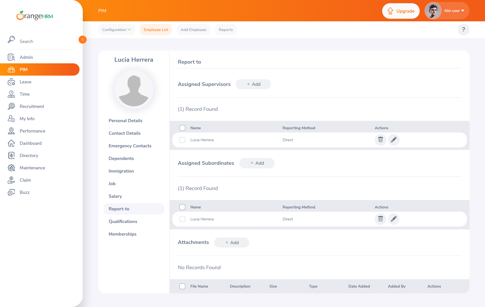

# BUG-011 — «Report-to» permite asignar a un empleado como supervisor de sí mismo

| | |
| --- | --- |
| **Severidad** | Media |
| **Prioridad** | Media |
| **Estado** | Abierto |
| **Módulo** | PIM > Report-to |
| **Requisito relacionado** | [RF-29](../00-requisitos.md#4-ficha-del-empleado--resto-de-secciones) |
| **Caso de prueba** | [CP-035](../02-casos-de-prueba.md#cp-035) |
| **Entorno** | Chrome (estable) · Windows 11 Pro 24H2 · `opensource-demo.orangehrmlive.com` (OrangeHRM OS 5.x) |
| **Reportado por** | David Coya Moreno |

## Precondiciones

Sesión iniciada con el usuario `Admin`. Ficha del empleado `Lucía Herrera` abierta.

## Pasos para reproducir

1. Abrir la ficha del empleado y situarse en la pestaña **Report-to**.
2. En el bloque *Assigned Supervisors*, pulsar **Add**.
3. En el campo *Name*, escribir `Lucía` —el nombre del **propio empleado de la ficha**— y
   seleccionarlo del desplegable de sugerencias.
4. Seleccionar un *Reporting Method* cualquiera.
5. Pulsar **Save**.
6. Recargar la página y revisar los bloques *Assigned Supervisors* y *Assigned Subordinates*.

## Resultado esperado

El sistema impide la asignación: un empleado no puede ser su propio supervisor. Lo esperable es que
el desplegable de sugerencias excluya al empleado de la ficha, o que la validación rechace el
guardado.

## Resultado obtenido

El registro se guarda. Tras recargar, el empleado aparece **simultáneamente en sus dos listas**:
como supervisor asignado y como subordinado asignado de sí mismo. La jerarquía queda con un ciclo de
longitud 1.

## Evidencia

**El mismo empleado figura simultáneamente como su supervisor asignado y como su subordinado asignado**


Es la captura que resume el defecto: la jerarquía de supervisión contiene un ciclo de longitud 1, y
la propia interfaz lo muestra en las dos tablas a la vez.

## Notas técnicas

La asignación se envía como
`POST /web/index.php/api/v2/pim/employees/{empNumber}/supervisors` con un cuerpo del tipo:

```json
{ "empNumber": 7, "reportingMethodId": 1 }
```

donde el `empNumber` del cuerpo **coincide con el de la ruta**. El servidor responde **200** sin
comprobar esa igualdad, que es la validación más simple posible del problema.

Durante la exploración se acotó el alcance del defecto, que es lo que decide si estamos ante un caso
aislado o ante un hueco general de validación de la jerarquía:

- **Ciclo de longitud 1** (A supervisa a A): reproducible, es lo que documenta este reporte.
- **Ciclo de longitud 2** (A supervisa a B y B supervisa a A): **pendiente de verificar** en el
  próximo ciclo. Requiere dos empleados de prueba y comprobar si existe detección de ciclos más allá
  del caso trivial.

Se deja constancia de esa comprobación pendiente en lugar de omitirla: si el ciclo de longitud 2
también fuera posible, la severidad de este defecto subiría, porque afectaría a los recorridos de la
jerarquía en flujos de aprobación reales.

## Análisis de impacto

Severidad **Media**. La creación es poco frecuente y evidente a simple vista en la propia ficha, lo
que facilita detectarla y corregirla a mano. El riesgo está aguas abajo: la jerarquía *Report-to*
alimenta los **flujos de aprobación** de otros módulos —solicitudes de permisos, aprobación de
partes de horas—, donde un empleado que se supervisa a sí mismo podría **aprobar sus propias
solicitudes**, saltándose el control de doble intervención.

Ese efecto no se ha verificado porque el módulo *Leave* está fuera del alcance declarado, pero es la
razón por la que este defecto no se clasifica como cosmético.

## Recomendación

1. Excluir al empleado de la ficha del desplegable de sugerencias de supervisores y subordinados.
2. Validar en servidor que el `empNumber` del cuerpo difiere del de la ruta.
3. Evaluar la detección de ciclos de longitud arbitraria en la jerarquía, en función del resultado
   de la comprobación pendiente indicada arriba.

---

## Verificación

Reproducido por API.

```jsonc
// POST /web/index.php/api/v2/pim/employees/{empNumber}/supervisors
{ "empNumber": 371, "reportingMethodId": 1 }   // el mismo empNumber de la ruta
// → 200
// respuesta: { "supervisor": { "empNumber": 371, … },
//              "reportingMethod": { "id": 1, "name": "Direct" } }
```

El servidor devuelve el propio empleado como su supervisor, con el método de reporte «Direct». La
comprobación de que el `empNumber` del cuerpo difiere del de la ruta —la validación más simple
posible de este problema— no existe.
