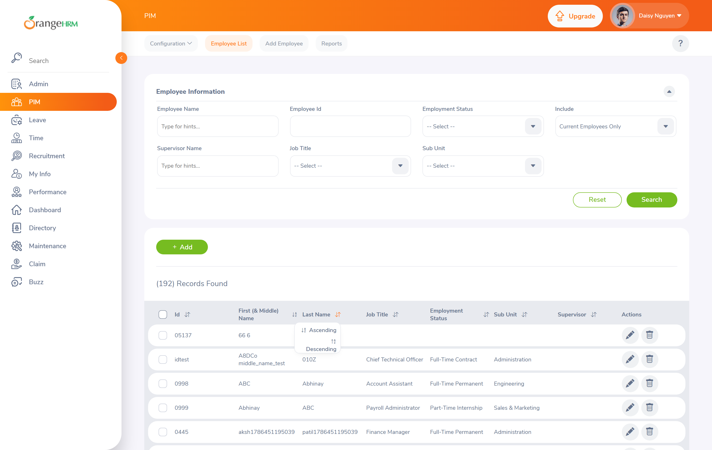
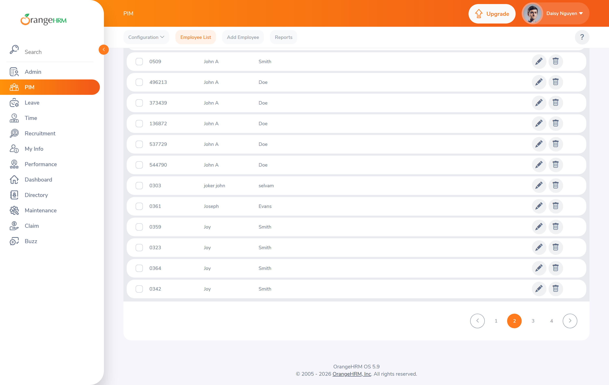

# Hipótesis de defecto descartadas

Seis comportamientos que durante el diseño de los casos se consideraron sospechosos y que, al
comprobarlos contra la aplicación, **resultaron ser correctos en cinco casos y no verificables en
uno**. No se han reportado como defectos.

Este documento existe porque el trabajo que lleva detrás es exactamente igual de real que el de los
defectos confirmados, y porque un defecto mal reportado cuesta tiempo a todo el equipo: el
desarrollador lo investiga, no lo reproduce, lo devuelve, y la confianza en los siguientes reportes
del mismo tester baja. **Comprobar antes de reportar es parte del trabajo, no un paso opcional.**

---

## Resumen

| Hipótesis | Caso | Veredicto | Qué ocurre en realidad |
| --- | --- | --- | --- |
| El alta con contraseña inválida deja el empleado creado | [CP-011](../02-casos-de-prueba.md#cp-011) | ❌ Descartada | La aplicación valida la contraseña **antes** de crear nada |
| La búsqueda por texto parcial devuelve «Invalid» | [CP-015](../02-casos-de-prueba.md#cp-015) | ❌ Descartada | La búsqueda parcial funciona con normalidad |
| La búsqueda no encuentra nombres con tilde | [CP-027](../02-casos-de-prueba.md#cp-027) | ❌ Descartada | La búsqueda es insensible a diacríticos |
| El campo de importe salarial acepta negativos | [CP-034](../02-casos-de-prueba.md#cp-034) | ❌ Descartada | El campo rechaza el importe negativo |
| La paginación no retrocede tras borrar el último registro | [CP-019](../02-casos-de-prueba.md#cp-019) | ⚠️ No verificable | El entorno no tiene registros suficientes para paginar |
| La ordenación se pierde al cambiar de página | [CP-020](../02-casos-de-prueba.md#cp-020) | ❌ Descartada | La ordenación se propaga correctamente al paginar |

---

## 1. El alta con contraseña inválida NO deja el empleado creado

**Hipótesis.** El formulario de alta guarda el empleado y sus credenciales en dos peticiones
separadas. Si la segunda falla por incumplir la política de contraseña, el empleado quedaría creado
sin acceso, y el administrador generaría un duplicado al reintentar.

**Comprobación.** Alta de `QaAtomic Prueba002` con *Create Login Details* activado y la contraseña
`test`, que incumple la política. Después, búsqueda del empleado en el listado.

**Resultado.** El empleado **no se crea**. En la pestaña *Network* se observa una única petición
antes del error:

```
POST /web/index.php/auth/public/validation/password    →  200
     { "password": "test" }
```

La aplicación consulta un **endpoint de validación de contraseña dedicado** y no continúa si la
política no se cumple. `POST /api/v2/pim/employees` no llega a emitirse. La operación es correcta
por diseño: el orden es validar primero, crear después.

**Por qué la hipótesis parecía razonable.** El formulario reúne dos entidades distintas —empleado y
usuario— en una sola pantalla, y ese patrón es una fuente habitual de escrituras parciales. La
sospecha estaba bien fundada; el diseño de la aplicación simplemente la resuelve mejor de lo
previsto.

---

## 2. La búsqueda por texto parcial funciona

**Hipótesis.** El campo *Employee Name* es un selector de entidad disfrazado de campo de texto, de
modo que escribir texto parcial sin elegir una sugerencia produciría el mensaje «Invalid» en vez de
buscar.

**Comprobación.** Escritura de un nombre parcial en el campo y pulsación directa de *Search*, sin
seleccionar sugerencia.

**Resultado.** La búsqueda **se ejecuta con normalidad** y devuelve resultados. En ningún momento
aparece el mensaje «Invalid».

**Matiz que conviene conservar.** El mensaje «Invalid» sí existe en la aplicación, pero se activa
ante un valor que no corresponde a ningún empleado, no ante un texto parcial legítimo. Confundir
ambos escenarios habría producido un reporte que el desarrollador no habría podido reproducir.

---

## 3. La búsqueda es insensible a los acentos

**Hipótesis.** Una colación de base de datos sensible a diacríticos impediría encontrar a un
empleado llamado `Mónica Núñez` buscando `Monica`.

**Comprobación.** Creación del empleado `Mónica Núñez` y dos búsquedas sobre el mismo listado:

```
GET /api/v2/pim/employees?…&nameOrId=Monica   →  1 resultado
GET /api/v2/pim/employees?…&nameOrId=Mónica   →  1 resultado
```

**Resultado.** Ambas búsquedas devuelven el empleado. La colación de las columnas de nombre
**equipara los diacríticos**, que es el comportamiento correcto.

**Lectura.** Era una hipótesis con fundamento —es un fallo frecuente en aplicaciones diseñadas con
datos en inglés y probadas solo con ellos— y merecía comprobarse. El resultado es que esta
aplicación lo hace bien.

---

## 4. El importe salarial rechaza los valores negativos

**Hipótesis.** El campo *Amount* de un componente salarial aceptaría `-1500`, permitiendo guardar
retribuciones negativas con impacto directo sobre la nómina.

**Comprobación.** Formulario *PIM > Salary > Add* con `-1500` en el campo *Amount*.

**Resultado.** El guardado se rechaza y el mensaje aparece **junto al campo correcto**:

```
Salary Component  →  Required
Currency          →  Required
Amount            →  Should be a number
```

El mensaje de *Amount* es específico del importe negativo: la validación del campo no admite el
signo menos. La hipótesis queda descartada.

**Importancia de haberlo comprobado.** Esta era, sobre el papel, la incidencia de mayor severidad
del ciclo, y era la que sostenía la recomendación de *no apto para release*. Publicarla sin
verificarla habría producido dos daños: una recomendación de release equivocada, y un reporte que el
equipo de desarrollo habría cerrado como no reproducible.

---

## 5. La ordenación sí se mantiene al cambiar de página

**Hipótesis.** El listado reconstruye la consulta al paginar sin arrastrar el criterio de
ordenación, de modo que la secuencia alfabética se rompe entre páginas.

**Historia de esta comprobación, que merece contarse.** En el primer intento el caso quedó
**bloqueado**: la instancia contenía entonces **4 empleados** y, con una paginación de 50, no existía
una segunda página que probar.

```
GET /api/v2/pim/employees?limit=1&offset=0…   →  meta.total = 4
```

Se descartó deliberadamente crear 50 empleados para forzar la situación: habría contaminado el
entorno compartido de los demás usuarios de la demo por una comprobación de severidad Baja.

Al volver sobre el entorno más tarde, la instancia se había repoblado hasta **188 empleados**. Es el
**riesgo R-01** del [plan de pruebas](../01-plan-de-pruebas.md#7-análisis-de-riesgos) —el volumen de
datos varía sin aviso— actuando esta vez a favor: el caso pasó a ser ejecutable y se ejecutó.

**Comprobación.** Ordenar el listado por una columna y avanzar a la página 2, comparando las dos
peticiones.

```
# al ordenar
GET …/pim/employees?limit=50&offset=0 &sortField=employee.firstName&sortOrder=ASC
# al pasar a la página 2
GET …/pim/employees?limit=50&offset=50&sortField=employee.firstName&sortOrder=ASC
```

**Resultado.** `sortField` y `sortOrder` **se propagan correctamente**. La hipótesis queda
descartada y [CP-020](../02-casos-de-prueba.md#cp-020) pasa a estado *Pasa*.

## 6. La paginación tras borrar el último registro sigue sin ser verificable

**Hipótesis.** Al borrar el único registro de la última página, el listado queda vacío sin retroceder
de página.

**Impedimento.** Reproducirla exige que la última página contenga **exactamente un registro**, es
decir, un total de la forma `50·n + 1`. Con 188 empleados, la última página contiene 38: borrar uno
no vacía la página. Conseguir la condición exigiría borrar 37 empleados de una instancia pública
compartida, lo que queda descartado sin discusión.

**Decisión.** [CP-019](../02-casos-de-prueba.md#cp-019) se registra como **bloqueado**, no como
fallado ni como superado. Un caso que no ha podido ejecutarse no aporta información sobre la calidad
del producto, y darlo por bueno en cualquiera de los dos sentidos sería inventarse un resultado.
Queda pendiente de un entorno propio.

---

## Lo que estas seis comprobaciones dicen del ciclo

De 12 sospechas iniciales, **6 se confirmaron como defectos, 5 resultaron ser comportamiento
correcto y 1 no pudo comprobarse**. Una tasa de acierto del 55 % sobre las hipótesis verificables.

No es un mal dato: las hipótesis se formulan precisamente sobre los puntos donde una aplicación
*suele* fallar, y comprobarlas es barato comparado con el coste de un reporte inválido. Lo que sería
un mal dato es haber publicado las doce.

Las cinco descartadas tienen además algo en común que merece anotarse: **en las cinco, la
aplicación se comporta mejor de lo que la hipótesis suponía**. Es un contrapeso honesto al hallazgo
transversal del ciclo —que la validación de dominio falta en varios endpoints— y evita que el
informe pinte la aplicación peor de lo que está.

### Evidencia de la comprobación de la ordenación

**Página 1 ordenada, y página 2 continuando la misma secuencia**


