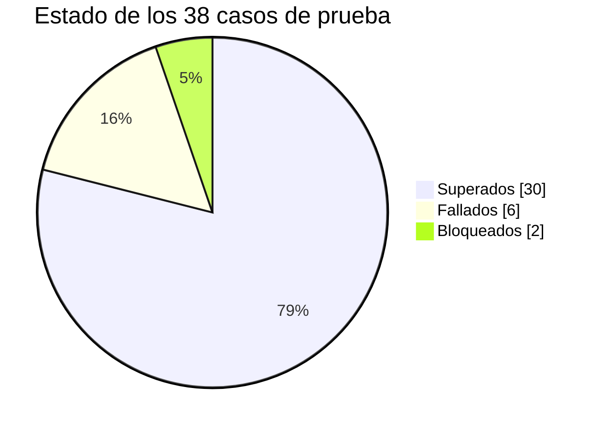
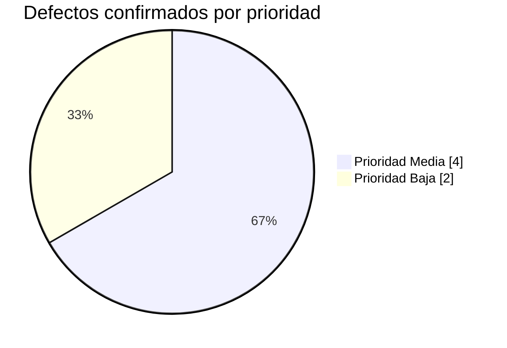

# 04 — Informe de ejecución · Módulo PIM (OrangeHRM OS)

| Campo | Valor |
| --- | --- |
| **Ciclo** | Ciclo 1 — pruebas funcionales de sistema |
| **Módulo** | PIM — *Personal Information Management* |
| **Entorno** | `opensource-demo.orangehrmlive.com` (OrangeHRM OS 5.9) · Windows 11 Pro 24H2 · Chrome (estable) |
| **Casos planificados** | 38 |
| **Autor** | David Coya Moreno — QA Tester |

---

## 1. Resultado en una línea

**El módulo se considera apto para release con reservas.** No hay defectos abiertos de severidad
Crítica ni Alta. Los 6 defectos confirmados son de severidad Media y ninguno bloquea un flujo de
negocio ni provoca pérdida de datos.

La reserva no está en la calidad del producto sino en la **cobertura**: 2 casos quedaron bloqueados
por limitaciones del entorno de demostración, de modo que el ciclo se queda en un 94,7 % de
ejecución frente al 95 % exigido en el §6.2 del [plan de pruebas](01-plan-de-pruebas.md).

---

## 2. Ejecución de los casos

| Métrica | Valor |
| --- | ---: |
| Casos planificados | 38 |
| Casos ejecutados | 36 |
| **Cobertura de ejecución** | **94,7 %** |
| Casos superados | 30 |
| Casos fallados | 6 |
| Casos bloqueados | 2 |
| **Tasa de éxito sobre ejecutados** | **83,3 %** |
| Casos de prioridad Alta ejecutados | 15 / 15 — **100 %** |

### Resultado por prioridad

| Prioridad | Planificados | Superados | Fallados | Bloqueados | Tasa de éxito |
| --- | ---: | ---: | ---: | ---: | ---: |
| Alta | 15 | 14 | 1 | 0 | 93,3 % |
| Media | 21 | 14 | 5 | 2 | 73,7 % |
| Baja | 2 | 2 | 0 | 0 | 100 % |
| **Total** | **38** | **30** | **6** | **2** | **83,3 %** |

### Casos bloqueados

| Caso | Motivo del bloqueo |
| --- | --- |
| [CP-019](02-casos-de-prueba.md#cp-019) — paginación tras borrar el último registro | Reproducirlo exige que la última página contenga **exactamente un registro**. Con los 188 empleados de la instancia, la última contiene 38: conseguir esa condición obligaría a borrar 37 registros de una demo pública compartida. Descartado por criterio. |
| [CP-036](02-casos-de-prueba.md#cp-036) — límite de tamaño de adjunto | El límite configurado no es consultable sin acceso a la configuración del servidor, y subir un fichero de gran tamaño a una instancia pública compartida se descarta por criterio (§2.2 del plan). |

Los dos se registran como **bloqueados y no como fallados ni superados**. Un caso que no ha podido
ejecutarse no aporta información sobre la calidad del producto, y darlo por bueno en cualquiera de
los dos sentidos sería inventarse un resultado.

**Nota sobre la volatilidad del entorno.** CP-019 y CP-020 estuvieron bloqueados en el primer
intento por un motivo distinto: la instancia contenía entonces **4 empleados** y no existía una
segunda página que probar. Al volver sobre ella más tarde se había repoblado hasta **188**, lo que
permitió ejecutar CP-020 —resultado *Pasa*— y dejó CP-019 bloqueado por la razón indicada arriba.
Es el **riesgo R-01** del plan actuando en los dos sentidos, y la razón por la que cada caso de este
ciclo crea sus propios datos. El detalle está en
[`03-bug-reports/DESCARTADOS.md`](03-bug-reports/DESCARTADOS.md).

---

## 3. Defectos detectados

**6 defectos confirmados**, todos de severidad Media. Ninguno Crítico ni Alto.

### Por severidad y prioridad

| | Prioridad Alta | Prioridad Media | Prioridad Baja | **Total** |
| --- | :---: | :---: | :---: | :---: |
| **Severidad Crítica** | 0 | 0 | 0 | **0** |
| **Severidad Alta** | 0 | 0 | 0 | **0** |
| **Severidad Media** | 0 | 4 | 2 | **6** |
| **Severidad Baja** | 0 | 0 | 0 | **0** |
| **Total** | **0** | **4** | **2** | **6** |

### Por área funcional

| Área | Defectos | Detalle |
| --- | ---: | --- |
| Add Employee | 2 | [BUG-001](03-bug-reports/BUG-001.md), [BUG-012](03-bug-reports/BUG-012.md) |
| Personal Details | 1 | [BUG-006](03-bug-reports/BUG-006.md) |
| Dependents | 1 | [BUG-008](03-bug-reports/BUG-008.md) |
| Job | 1 | [BUG-009](03-bug-reports/BUG-009.md) |
| Report-to | 1 | [BUG-011](03-bug-reports/BUG-011.md) |

---

## 4. Hallazgo transversal: la validación de dominio falta en el servidor

Más allá del recuento, el ciclo deja una conclusión que ningún defecto individual expresa por
completo. De los 6 defectos confirmados, **5 tienen la misma naturaleza**: la aplicación aplica
validación de formato o de tipo, pero **el servidor acepta el valor sin comprobar la regla de
negocio**.

Confirmado inspeccionando las peticiones: en BUG-001, BUG-006, BUG-008, BUG-009 y BUG-011 la API
responde **200** ante datos que la lógica de negocio debería rechazar. Cada reporte recoge en su
sección *Verificación* la petición y la respuesta exactas.

Tres consecuencias que conviene poner por delante en la reunión de triaje:

1. **Corregir solo el cliente no cierra ninguno de estos defectos.** Cualquier consumidor directo de
   la API —una importación masiva de empleados, una integración con la nómina— podrá seguir
   introduciendo los mismos datos inválidos.
2. **La estimación cambia.** Cinco defectos con una causa común se abordan mejor como una tarea de
   validación en servidor que como cinco correcciones aisladas.
3. **La regresión debe atacar la API**, no solo la interfaz. Un caso de prueba que solo pulse
   botones no detectaría una reaparición del problema.

### Agrupación por causa raíz

| Causa raíz | Defectos | Corrección sugerida |
| --- | --- | --- |
| Ausencia de validación de fechas transversal | [BUG-006](03-bug-reports/BUG-006.md), [BUG-008](03-bug-reports/BUG-008.md), [BUG-009](03-bug-reports/BUG-009.md) | Capa de validación de fechas compartida por el módulo, en servidor |
| Validación de dominio ausente en el endpoint | [BUG-001](03-bug-reports/BUG-001.md), [BUG-011](03-bug-reports/BUG-011.md) | Reglas de dominio en los endpoints correspondientes |
| Etiquetado accesible del componente de campo | [BUG-012](03-bug-reports/BUG-012.md) | Corrección en el componente reutilizable del sistema de diseño |

**6 defectos reportados se resuelven con 3 líneas de trabajo, no con 6.**

### El contrapeso: dónde la aplicación valida bien

Un informe que solo enumere fallos describe mal el producto. De las 12 hipótesis de defecto
formuladas durante el diseño de los casos, **5 resultaron ser comportamiento correcto**:

| Comprobación | Resultado |
| --- | --- |
| Alta con contraseña inválida | La contraseña se valida **antes** de crear el empleado. La operación es correcta por diseño. |
| Búsqueda por texto parcial | Funciona con normalidad. |
| Búsqueda con y sin tildes | La colación equipara diacríticos. |
| Importe salarial negativo | El campo lo rechaza con mensaje específico. |
| Ordenación al cambiar de página | `sortField` y `sortOrder` se propagan correctamente al paginar. |

El detalle de cada comprobación está en
[`03-bug-reports/DESCARTADOS.md`](03-bug-reports/DESCARTADOS.md). La conclusión matizada es que **la
validación de esta aplicación es sólida en el cliente y desigual en el servidor**, no que sea
deficiente en general.

---

## 5. Cobertura de requisitos

| Tipo | Total | Con al menos un caso | Cobertura |
| --- | ---: | ---: | ---: |
| Requisitos funcionales (RF) | 30 | 27 | 90,0 % |
| Reglas de negocio (RN) | 5 | 4 | 80,0 % |
| Requisitos no funcionales (RNF) | 5 | 3 | 60,0 % |
| **Total** | **40** | **34** | **85,0 %** |

De los 34 requisitos con cobertura, **6 resultaron incumplidos** y el resto se verificó sin
incidencias. El detalle requisito a requisito está en la
[matriz de trazabilidad](05-matriz-trazabilidad.md).

### Huecos de cobertura conocidos

Se declaran de forma explícita. Un informe que presentara una cobertura del 100 % sin justificarla
sería menos fiable que uno que reconoce dónde no ha llegado:

| Requisito | Motivo por el que no se ha cubierto |
| --- | --- |
| RF-03 — *Employee Id* correlativo autogenerado | En una instancia pública compartida, otros usuarios crean empleados en paralelo. La correlatividad no es verificable de forma fiable ni reproducible. |
| RF-21 — *Custom Fields* | Requiere modificar la configuración global de PIM en un entorno compartido, lo que alteraría la experiencia de otros usuarios de la demo. Se descarta por criterio. |
| RF-27 — Datos de puesto (*Job*) | Cubierto solo de forma parcial a través de CP-033, centrado en la coherencia de fechas. Los catálogos de puesto, categoría y ubicación quedan pendientes del ciclo 2. |
| RN-05 — Borrado sin registros huérfanos | No verificable sin acceso a la base de datos (riesgo R-06 del plan). Pendiente de un entorno propio. |
| RNF-04 — Tiempos de respuesta | Solo se registra el tiempo **percibido**; no se mide. Medir sobre una instancia pública compartida daría cifras sin valor, y generar carga está fuera del alcance por criterio. |
| RNF-05 — Equivalencia entre navegadores | **No ejecutado en el ciclo 1.** La reejecución de los 15 casos de prioridad Alta en Firefox y Edge queda planificada para el ciclo 2. Se declara como hueco abierto en lugar de darlo por cubierto. |
| Segregación de permisos por rol ESS | Riesgo R-04 del plan: la demo no permite un usuario ESS estable con credenciales conocidas. |

Ninguno de estos huecos afecta a un requisito de prioridad Alta.

---

## 6. Evaluación frente a los criterios de salida

| Criterio (§6.2 del plan) | Objetivo | Resultado | ¿Cumple? |
| --- | --- | --- | :---: |
| Casos ejecutados | ≥ 95 % | 94,7 % | ❌ |
| Casos de prioridad Alta ejecutados | 100 % | 100 % | ✅ |
| Defectos abiertos Críticos o Altos | 0 | **0** | ✅ |
| Defectos Medios con análisis de impacto documentado | 100 % | 100 % | ✅ |
| Informe de ejecución emitido con recomendación | Sí | Sí | ✅ |

**Cuatro de cinco criterios cumplidos**, y el quinto se queda a tres décimas: 94,7 % frente al 95 %
exigido. La causa está identificada: los 2 casos bloqueados lo están por limitaciones del **entorno
de demostración**, no por defectos del producto ni por falta de tiempo. Es una distinción que cambia la decisión: no
hay riesgo desconocido sobre la funcionalidad, hay funcionalidad que este entorno no permite probar.

---

## 7. Conclusión y recomendación

### Recomendación: APTO PARA RELEASE CON RESERVAS

No hay defectos de severidad Crítica ni Alta. Los flujos de alta, consulta, edición y borrado
funcionan, los campos obligatorios se validan, la operación de alta con credenciales es atómica y
los datos persisten correctamente.

Los 6 defectos confirmados comparten un mismo perfil: **la interfaz valida, el servidor no**. Ninguno
impide operar, pero todos permiten introducir datos que el negocio no debería admitir, y por API sin
obstáculo alguno.

Las dos reservas, en orden de importancia:

1. **Cobertura de ejecución al 94,7 %.** Dos casos sin ejecutar por limitaciones del entorno. Antes
   de un release real conviene cerrarlos en un entorno con volumen de datos controlado.
2. **Validación de dominio ausente en 5 endpoints.** No bloquea, pero degrada el dato maestro de
   forma acumulativa y silenciosa.

### Plan de acción propuesto

| Orden | Acción | Justificación |
| --- | --- | --- |
| 1 | Confirmar con negocio las tres reglas derivadas marcadas *requiere confirmación* (RN-01 y RN-02) | Condicionan si BUG-006, BUG-008 y BUG-009 son defectos o comportamiento previsto. Sin esa respuesta, la corrección puede ser innecesaria o quedarse corta. |
| 2 | Abordar la validación de fechas en servidor como una sola línea de trabajo | Cierra 3 defectos con un esfuerzo notablemente menor que corregirlos por separado. |
| 3 | Añadir validación de dominio en los endpoints de nombre y de supervisión | Cierra BUG-001 y BUG-011. |
| 4 | Ejecutar CP-019 y CP-036 en un entorno con volumen de datos propio | Es lo único que separa al ciclo del criterio de salida. |
| 5 | Planificar [BUG-012](03-bug-reports/BUG-012.md) dentro de una revisión de accesibilidad | Conviene corregirlo en el componente compartido, no formulario a formulario. |

### Condición para levantar las reservas

El módulo pasará a **apto sin reservas** cuando los dos casos bloqueados se ejecuten con resultado
satisfactorio en un entorno adecuado y los defectos de la línea de validación de fechas estén
corregidos y con retest superado. Se estima un ciclo de verificación de **medio día**, una vez
disponible el entorno.

---

La recomendación de este informe es una **recomendación técnica de QA**. La decisión de release
corresponde al responsable de producto, que puede asumir el riesgo documentado con conocimiento de
causa. La función del QA es que esa decisión no se tome a ciegas.
