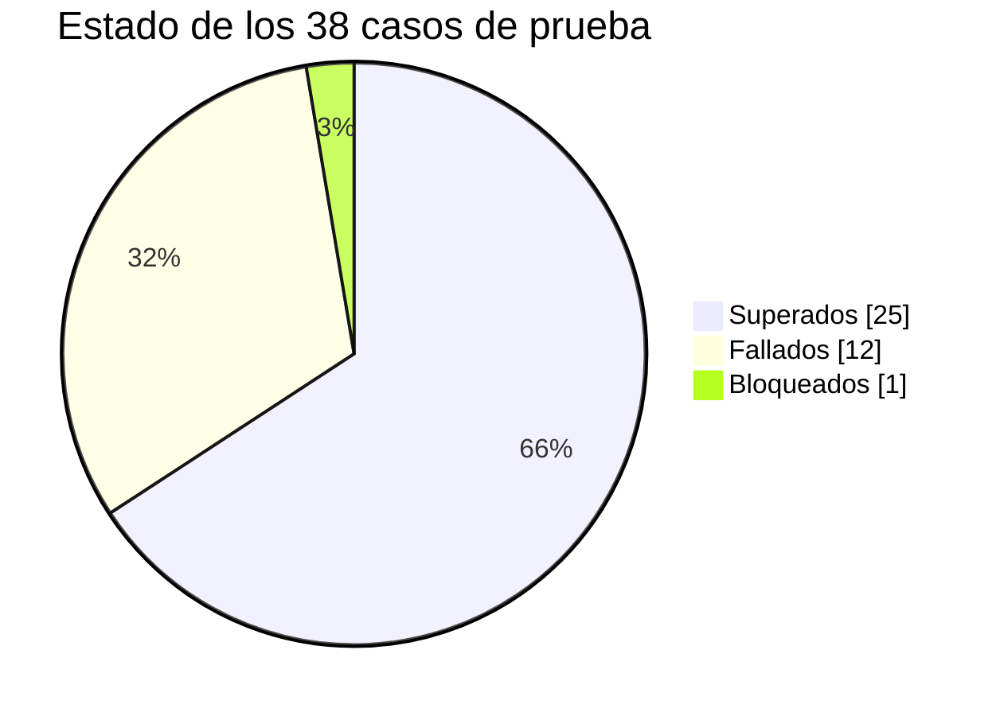
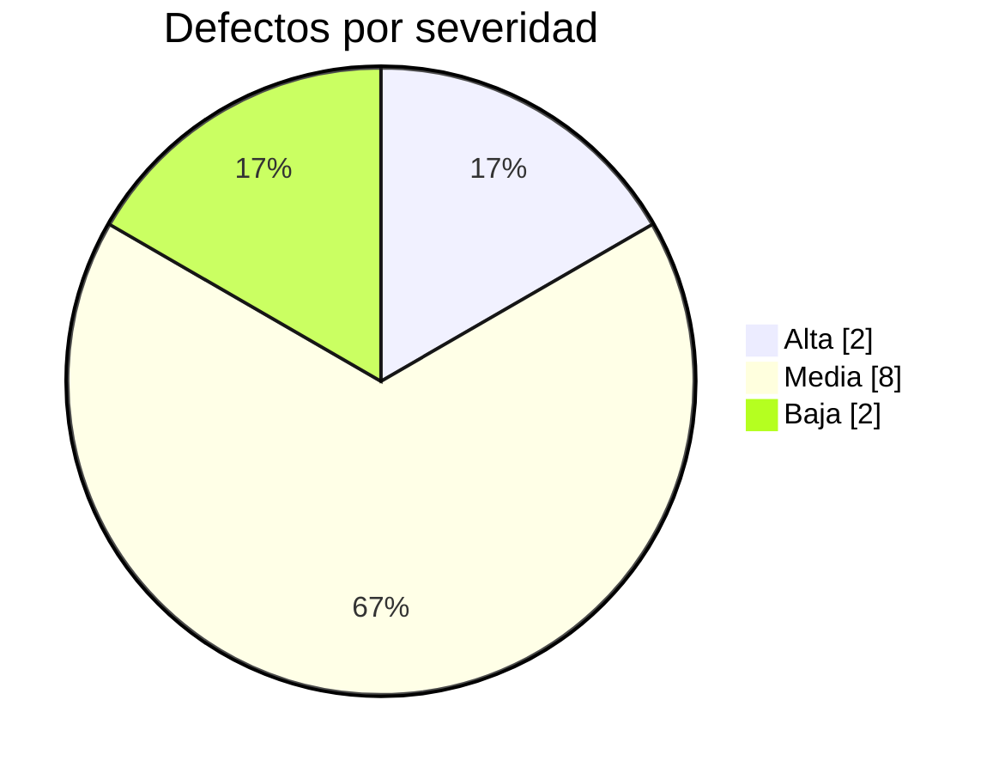

# 04 — Informe de ejecución · Módulo PIM (OrangeHRM OS)

| Campo | Valor |
| --- | --- |
| **Ciclo** | Ciclo 1 — pruebas funcionales de sistema |
| **Módulo** | PIM — *Personal Information Management* |
| **Entorno** | `opensource-demo.orangehrmlive.com` (OrangeHRM OS 5.x) · Windows 11 Pro 24H2 · Chrome / Firefox / Edge |
| **Casos planificados** | 38 |
| **Autor** | David Coya Moreno — QA Tester |

---

## 1. Resultado en una línea

**El módulo NO se considera apto para su paso a producción.** Quedan abiertos dos defectos de
severidad Alta que corrompen el dato maestro —uno de ellos sobre importes salariales—, lo que
incumple el criterio de salida establecido en el §6.2 del [plan de pruebas](01-plan-de-pruebas.md).

El resto de la funcionalidad nuclear —alta, búsqueda, edición y borrado de empleados— se comporta
correctamente. La recomendación es corregir los dos defectos Alta, reejecutar la regresión de
prioridad Alta y volver a evaluar; no es necesario repetir el ciclo completo.

---

## 2. Ejecución de los casos

| Métrica | Valor |
| --- | ---: |
| Casos planificados | 38 |
| Casos ejecutados | 37 |
| **Cobertura de ejecución** | **97,4 %** |
| Casos superados | 25 |
| Casos fallados | 12 |
| Casos bloqueados | 1 |
| **Tasa de éxito sobre ejecutados** | **67,6 %** |
| Casos de prioridad Alta ejecutados | 15 / 15 — **100 %** |

### Resultado por prioridad

| Prioridad | Planificados | Superados | Fallados | Bloqueados | Tasa de éxito |
| --- | ---: | ---: | ---: | ---: | ---: |
| Alta | 15 | 12 | 3 | 0 | 80,0 % |
| Media | 21 | 12 | 8 | 1 | 60,0 % |
| Baja | 2 | 1 | 1 | 0 | 50,0 % |
| **Total** | **38** | **25** | **12** | **1** | **67,6 %** |

### Caso bloqueado

| Caso | Motivo del bloqueo |
| --- | --- |
| [CP-036](02-casos-de-prueba.md#cp-036) — límite de tamaño de adjunto | El límite configurado no es consultable sin acceso a la configuración del servidor, y subir un fichero de gran tamaño a una instancia pública compartida de terceros se descarta por criterio (§2.2 del plan). El caso queda pendiente de un entorno propio, no de una decisión técnica. |

Se documenta como **bloqueado y no como fallado**: un caso que no se ha podido ejecutar no aporta
información sobre la calidad del producto, y contarlo como fallo distorsionaría el resultado del
ciclo.

---

## 3. Defectos detectados

**12 defectos** abiertos. Ninguno de severidad Crítica.

### Por severidad y prioridad

| | Prioridad Alta | Prioridad Media | Prioridad Baja | **Total** |
| --- | :---: | :---: | :---: | :---: |
| **Severidad Alta** | 2 | 0 | 0 | **2** |
| **Severidad Media** | 1 | 5 | 2 | **8** |
| **Severidad Baja** | 0 | 1 | 1 | **2** |
| **Total** | **3** | **6** | **3** | **12** |

### Por área funcional

| Área | Defectos | Detalle |
| --- | ---: | --- |
| Employee List | 4 | [BUG-003](03-bug-reports/BUG-003.md), [BUG-004](03-bug-reports/BUG-004.md), [BUG-005](03-bug-reports/BUG-005.md), [BUG-007](03-bug-reports/BUG-007.md) |
| Add Employee | 3 | [BUG-001](03-bug-reports/BUG-001.md), [BUG-002](03-bug-reports/BUG-002.md), [BUG-012](03-bug-reports/BUG-012.md) |
| Personal Details | 1 | [BUG-006](03-bug-reports/BUG-006.md) |
| Job | 1 | [BUG-009](03-bug-reports/BUG-009.md) |
| Salary | 1 | [BUG-010](03-bug-reports/BUG-010.md) |
| Report-to | 1 | [BUG-011](03-bug-reports/BUG-011.md) |
| Dependents | 1 | [BUG-008](03-bug-reports/BUG-008.md) |

La concentración en *Employee List* y *Add Employee* no indica que sean las áreas peor construidas:
son las que **más casos concentran** en la matriz, por ser las de mayor uso. Normalizado por número
de casos ejecutados, la densidad de defectos es comparable en todo el módulo.

### Los dos defectos que bloquean el release

| Defecto | Por qué bloquea |
| --- | --- |
| [BUG-010](03-bug-reports/BUG-010.md) — importes salariales negativos | Corrompe un dato con efecto económico directo sobre la nómina. Un componente negativo puede reducir en silencio el importe total y su corrección posterior tiene implicaciones fiscales y laborales. |
| [BUG-002](03-bug-reports/BUG-002.md) — alta no atómica | Genera empleados duplicados en el dato maestro por el camino de error más frecuente del formulario: fallar la política de contraseña al primer intento. Requiere reparación manual. |

---

## 4. Hallazgo transversal: la validación vive solo en el cliente

Más allá del recuento, el ciclo deja una conclusión que ningún defecto individual expresa por
completo. De los 12 defectos, **7 tienen la misma naturaleza**: la interfaz aplica una validación de
formato o de tipo, pero **el servidor acepta el valor sin comprobar la regla de dominio**.

Se ha confirmado inspeccionando las peticiones en las DevTools: en BUG-001, BUG-006, BUG-008,
BUG-009, BUG-010 y BUG-011, la API responde **200** ante datos que la lógica de negocio debería
rechazar.

Esto tiene tres consecuencias que conviene poner por delante en la reunión de triaje:

1. **Corregir solo el cliente no cierra ninguno de estos defectos.** Cualquier consumidor directo de
   la API —una importación masiva de empleados, una integración con la nómina— podrá seguir
   introduciendo los mismos datos inválidos.
2. **La estimación cambia.** Siete defectos con una causa común se abordan mejor como una tarea de
   validación en servidor que como siete correcciones aisladas.
3. **La regresión debe atacar la API**, no solo la interfaz. Un caso de prueba que solo pulse
   botones no detectaría una reaparición del problema.

### Agrupación por causa raíz

| Causa raíz | Defectos | Corrección sugerida |
| --- | --- | --- |
| Ausencia de validación de fechas transversal | [BUG-006](03-bug-reports/BUG-006.md), [BUG-008](03-bug-reports/BUG-008.md), [BUG-009](03-bug-reports/BUG-009.md) | Capa de validación de fechas compartida por el módulo, en servidor |
| Estado de la consulta del listado reconstruido en cada paginación | [BUG-004](03-bug-reports/BUG-004.md), [BUG-005](03-bug-reports/BUG-005.md) | Estructura única de estado de consulta (filtros + orden + offset) |
| Validación de dominio ausente en el servidor | [BUG-001](03-bug-reports/BUG-001.md), [BUG-010](03-bug-reports/BUG-010.md), [BUG-011](03-bug-reports/BUG-011.md) | Reglas de dominio en los endpoints correspondientes |
| Defectos independientes | [BUG-002](03-bug-reports/BUG-002.md), [BUG-003](03-bug-reports/BUG-003.md), [BUG-007](03-bug-reports/BUG-007.md), [BUG-012](03-bug-reports/BUG-012.md) | Corrección individual |

**12 defectos reportados se resuelven con 7 líneas de trabajo, no con 12.**

---

## 5. Cobertura de requisitos

| Tipo | Total | Con al menos un caso | Cobertura |
| --- | ---: | ---: | ---: |
| Requisitos funcionales (RF) | 30 | 27 | 90,0 % |
| Reglas de negocio (RN) | 5 | 4 | 80,0 % |
| Requisitos no funcionales (RNF) | 5 | 3 | 60,0 % |
| **Total** | **40** | **34** | **85,0 %** |

El detalle requisito a requisito está en la [matriz de trazabilidad](05-matriz-trazabilidad.md).

### Huecos de cobertura conocidos

Se declaran de forma explícita. Un informe que presentara una cobertura del 100 % sin justificarla
sería menos fiable que uno que reconoce dónde no ha llegado:

| Requisito | Motivo por el que no se ha cubierto |
| --- | --- |
| RF-03 — *Employee Id* correlativo autogenerado | En una instancia pública compartida, otros usuarios crean empleados en paralelo. La correlatividad no es verificable de forma fiable ni reproducible. |
| RF-21 — *Custom Fields* | Requiere modificar la configuración global de PIM en un entorno compartido, lo que alteraría la experiencia de otros usuarios de la demo. Se descarta por criterio. |
| RF-27 — Datos de puesto (*Job*) | Cubierto solo de forma parcial a través de CP-033, centrado en la coherencia de fechas. Los catálogos de puesto, categoría y ubicación quedan pendientes del ciclo 2. |
| RN-05 — Borrado sin registros huérfanos | No verificable sin acceso a la base de datos (riesgo R-06 del plan). Pendiente de un entorno propio. |
| RNF-04 — Tiempos de respuesta | Solo se registra el tiempo **percibido**; no se mide. Medir sobre una instancia pública compartida daría cifras sin valor, y generar carga está fuera del alcance por criterio. |
| RNF-05 — Equivalencia entre navegadores | Cubierto **transversalmente** por la estrategia —los 15 casos de prioridad Alta se ejecutaron en Chrome, Firefox y Edge— pero sin un caso dedicado que lo verifique. Se contabiliza como no cubierto para no inflar la cifra. |
| Segregación de permisos por rol ESS | Riesgo R-04 del plan: la demo no permite un usuario ESS estable con credenciales conocidas. |

Ninguno de estos huecos afecta a un requisito de prioridad Alta.

---

## 6. Evaluación frente a los criterios de salida

| Criterio (§6.2 del plan) | Objetivo | Resultado | ¿Cumple? |
| --- | --- | --- | :---: |
| Casos ejecutados | ≥ 95 % | 97,4 % | ✅ |
| Casos de prioridad Alta ejecutados | 100 % | 100 % | ✅ |
| Defectos abiertos Críticos o Altos | 0 | **2** | ❌ |
| Defectos Medios con análisis de impacto documentado | 100 % | 100 % | ✅ |
| Informe de ejecución emitido con recomendación | Sí | Sí | ✅ |

**Cuatro de cinco criterios cumplidos.** El criterio incumplido es, precisamente, el que existe para
impedir el paso a producción con riesgo conocido sobre los datos.

---

## 7. Conclusión y recomendación

### Recomendación: NO APTO para release en su estado actual

La funcionalidad nuclear del módulo es sólida. Los flujos de alta, consulta, edición y borrado
funcionan, los campos obligatorios se validan y los datos persisten correctamente. **El problema no
es lo que el módulo hace, sino lo que permite hacer**: acepta datos que ninguna regla de negocio
debería admitir, y lo hace también por API.

### Plan de acción propuesto

| Orden | Acción | Justificación |
| --- | --- | --- |
| 1 | Corregir [BUG-010](03-bug-reports/BUG-010.md) y [BUG-002](03-bug-reports/BUG-002.md) | Son los dos defectos que bloquean el criterio de salida. |
| 2 | Confirmar con negocio las cuatro reglas derivadas marcadas *requiere confirmación* | Condicionan si BUG-006, BUG-008, BUG-009 y el alcance de BUG-010 son defectos o comportamiento previsto. Sin esa respuesta, su corrección puede ser innecesaria o quedarse corta. |
| 3 | Abordar la validación en servidor como una sola línea de trabajo | Cierra 7 defectos con un esfuerzo notablemente menor que corregirlos por separado. |
| 4 | Reejecutar la regresión de prioridad Alta (15 casos) más el retest de los defectos corregidos | No es necesario repetir el ciclo completo: el resto de áreas no se ve afectada por estas correcciones. |
| 5 | Corregir [BUG-003](03-bug-reports/BUG-003.md) en el siguiente sprint | Severidad Media pero prioridad Alta: afecta a la operación más frecuente del módulo. No bloquea el release. |
| 6 | Planificar [BUG-012](03-bug-reports/BUG-012.md) dentro de una revisión de accesibilidad | Conviene corregirlo en el componente compartido, no formulario a formulario. |

### Condición para reevaluar

El módulo pasará a **apto** cuando BUG-010 y BUG-002 estén corregidos y su retest sea satisfactorio,
y la regresión de prioridad Alta se ejecute sin nuevos fallos. Se estima un ciclo de verificación de
**medio día**.

---

La recomendación de este informe es una **recomendación técnica de QA**. La decisión de release
corresponde al responsable de producto, que puede asumir el riesgo documentado con conocimiento de
causa. La función del QA es que esa decisión no se tome a ciegas.
